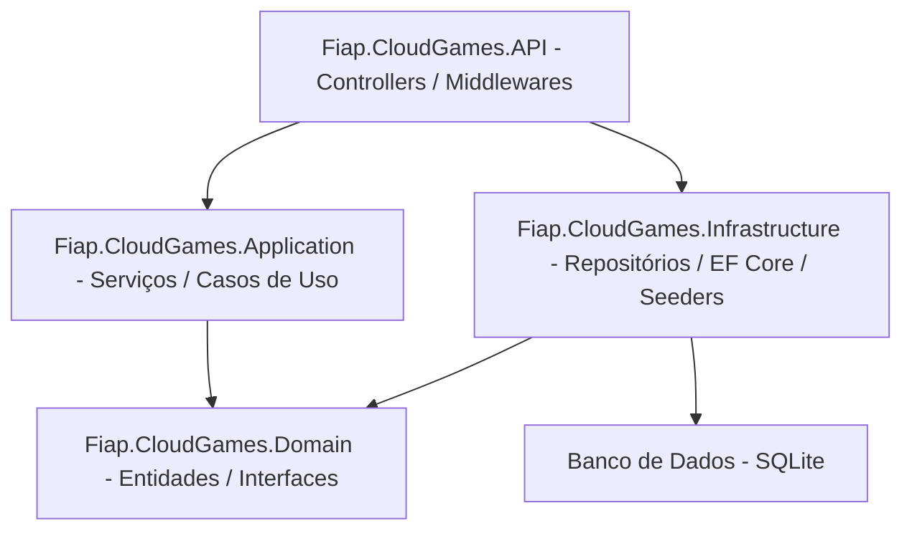

# Tech Challenge - FIAP Cloud Games - 10NETT - Grupo 8 📚

## Sumário 📝

- [Como rodar o projeto localmente](#como-rodar-o-projeto-localmente)
	- [Pré-requisitos](#pre-requisitos)
	- [Configurar segredos em DEV](#configurar-segredos-em-dev)
	- [Executando a aplicação](#executando-a-aplicacao)
- [Estrutura de pastas do Projeto](#estrutura-de-pastas-do-projeto)
- [Arquitetura do Projeto](#arquitetura-do-projeto)
	- [Principais projetos](#principais-projetos)
	- [Tecnologias e escolhas](#tecnologias-e-escolhas)
    - [Bibliotecas principais utilizadas](#bibliotecas-principais-utilizadas)
	- [Diagrama de dependências entre camadas](#diagrama-de-dependencias-entre-camadas)
- [Como Adicionar migrações e atualizar banco de dados](#como-adicionar-migracoes-e-atualizar-banco-de-dados)

---

<a id="como-rodar-o-projeto-localmente"></a>
## Como rodar o projeto localmente ▶️

<a id="pre-requisitos"></a>
### Pré-requisitos ⚙️
- Visual Studio2022 ou Visual Studio Code. [Download Visual Studio](https://visualstudio.microsoft.com/downloads/) | [Download VS Code](https://code.visualstudio.com/download)
- NET8 SDK mais recente instalado. [Download .NET8](https://dotnet.microsoft.com/en-us/download/dotnet/8.0)
- DBeaver ou outro cliente de banco de dados compatível com SQLite. [Download DBeaver](https://dbeaver.io/download/)
- Git instalado para clonar o repositório. [Download Git](https://git-scm.com/downloads)
- (Optional) Postman ou outra ferramenta para testar APIs REST. [Download Postman](https://www.postman.com/downloads/)

<a id="configurar-segredos-em-dev"></a>
### Configurar segredos em DEV 🔒	
Configurar String de Conexão do Banco de Dados:
```bash
dotnet user-secrets set "ConnectionStrings:DefaultConnection" "Data Source=fiap.cloudgames.dev.db" --project src/Fiap.CloudGames.Api/Fiap.CloudGames.Api.csproj
```

Configurar JWT:
```bash
dotnet user-secrets set "Jwt:Issuer" "<issuer>" --project src/Fiap.CloudGames.Api/Fiap.CloudGames.Api.csproj
dotnet user-secrets set "Jwt:Audience" "<audience>" --project src/Fiap.CloudGames.Api/Fiap.CloudGames.Api.csproj
dotnet user-secrets set "Jwt:Secret" "<chave-secreta>" --project src/Fiap.CloudGames.Api/Fiap.CloudGames.Api.csproj
dotnet user-secrets set "Jwt:ExpiryMinutes" "<tempo-expiracao-minutos>" --project src/Fiap.CloudGames.Api/Fiap.CloudGames.Api.csproj
```
> Obs: Exemplos de geração de chave aleatória:
> - PowerShell:
> ```powershell
> $chars = "abcdefghijklmnopqrstuvwxyzABCDEFGHIJKLMNOPQRSTUVWXYZ0123456789!@#$%^&*()_-+=<>?"; $secret = -join (1..64 | ForEach-Object { $chars[(Get-Random -Maximum $chars.Length)] }); Write-Output $secret
> ```
> - Linux/macOS:
> ```bash
> head -c64 /dev/urandom | base64
> ```

Configurar Senha do Administrador:
```bash
dotnet user-secrets set "AdminUser:Name" "<nome-usuario>" --project src/Fiap.CloudGames.Api/Fiap.CloudGames.Api.csproj
dotnet user-secrets set "AdminUser:Email" "<email-usuario>" --project src/Fiap.CloudGames.Api/Fiap.CloudGames.Api.csproj
dotnet user-secrets set "AdminUser:Password" "<senha-temporaria>" --project src/Fiap.CloudGames.Api/Fiap.CloudGames.Api.csproj
dotnet user-secrets set "AdminUser:Role" "Administrator" --project src/Fiap.CloudGames.Api/Fiap.CloudGames.Api.csproj
dotnet user-secrets set "AdminUser:Status" "Active" --project src/Fiap.CloudGames.Api/Fiap.CloudGames.Api.csproj
dotnet user-secrets set "AdminUser:EmailConfirmed" true --project src/Fiap.CloudGames.Api/Fiap.CloudGames.Api.csproj
```
> Observações:
> - O nome do usuário administrativo não pode estar vazio.
> - O e-mail do usuário administrativo deve estar em um formato válido.
> - A senha temporária deverá obedecer as regras de complexidade definidas no sistema:
> 	- Mínimo de8 caracteres
> 	- Pelo menos uma letra maiúscula
> 	- Pelo menos uma letra minúscula
> 	- Pelo menos um número
> 	- Pelo menos um caractere especial
> - O role do usuário administrativo deve ser "Administrator" para garantir privilégios administrativos.
> - O status do usuário administrativo deve ser "Active" para permitir o login imediato.
> - O e-mail do usuário administrativo deve ser marcado como confirmado (true) para permitir o acesso imediato.

<a id="executando-a-aplicacao"></a>
### Executando a aplicação ▶️
Clonar o repositório:
```bash
git clone https://github.com/FIAP-10NET-Grupo-8/cloud-games.git
```

Navegar até o diretório do repositório:
```bash
cd cloud-games
```

Restaurar as dependências do projeto:
```bash
dotnet restore src/Fiap.CloudGames.Api/Fiap.CloudGames.Api.csproj
```

Construir o projeto:
```bash
dotnet build src/Fiap.CloudGames.Api/Fiap.CloudGames.Api.csproj
```

Aplicar as migrações e criar o banco de dados (SQLite):
```bash
dotnet ef database update --project src/Fiap.CloudGames.Infrastructure/Fiap.CloudGames.Infrastructure.csproj --startup-project src/Fiap.CloudGames.Api/Fiap.CloudGames.Api.csproj --context AppDbContext
```

Executar a aplicação:
```bash
dotnet run --project src/Fiap.CloudGames.Api/Fiap.CloudGames.Api.csproj
```

Acessar a API via navegador (ou se preferir, Postman):
```
http://localhost:5000/swagger
```
---

<a id="estrutura-de-pastas-do-projeto"></a>
## Estrutura de pastas do Projeto 📁
```
├── src/
│ ├── Fiap.CloudGames.Api/                      # Camada de API (Controllers, Middlewares, Configurações)
│ ├── Fiap.CloudGames.Application/              # Serviços de aplicação e casos de uso
│ ├── Fiap.CloudGames.Domain/                   # Entidades, Value Objects, Enums e Interfaces
│ └── Fiap.CloudGames.Infrastructure/           # Implementações de persistência e integrações externas
├── tests/
│ └── Fiap.CloudGames.Tests/                    # Testes unitários
└── spikes-e-pocs/                              # Provas de conceito e experimentos
```

---

<a id="arquitetura-do-projeto"></a>
## Arquitetura do Projeto 🏛️

Este repositório segue uma arquitetura em camadas, inspirada em padrões como Clean Architecture / Onion, organizada para separar responsabilidades, facilitar testes e permitir evolução independente das camadas.

<a id="principais-projetos"></a>
### Principais projetos 📦
- `src/Fiap.CloudGames.Api` — Camada de API: controllers, middlewares, configuração de pipeline HTTP e autenticação (Swagger, JWT).
- `src/Fiap.CloudGames.Application` — Camada de aplicação: serviços, casos de uso e orquestração de regras de negócio.
- `src/Fiap.CloudGames.Domain` — Camada de domínio: entidades, value objects, enums e interfaces (contratos de repositório e serviços de domínio).
- `src/Fiap.CloudGames.Infrastructure` — Camada de infraestrutura: implementações concretas (persistência com EF Core, seeders, integrações externas, configuração de `AppDbContext`).
- `tests/Fiap.CloudGames.Tests` — Testes unitários para serviços e regras de negócio.

<a id="tecnologias-e-escolhas"></a>
### Tecnologias e escolhas ⚖️
- Target framework: `.NET8`
- Persistência: `Entity Framework Core` com provedor `SQLite` (arquivo local para DEV). Migrations centralizadas em `src/Fiap.CloudGames.Infrastructure/Persistence/Migrations`.
- Hash de senhas: `BCrypt` (armazenamento seguro de senhas de usuários já com salt).
- Autenticação: JWT (configurada via `appsettings.json`, `dotnet user-secrets` ou variáveis de ambiente; ver `src/Fiap.CloudGames.Infrastructure/Auth/JwtOptions.cs`).
- Logging: `Serilog` (configurado na startup da API para logs estruturados).
- Documentação da API: `Swagger` (acessível em `/swagger` quando executando localmente).
- Seeders: classes de seed (ex.: `UserSeeder`) para popular dados iniciais.

<a id="bibliotecas-principais-utilizadas"></a>
### Bibliotecas principais utilizadas 🧰
- `Microsoft.EntityFrameworkCore` e `Microsoft.EntityFrameworkCore.Sqlite`: ORM e provedor SQLite.
- `Microsoft.AspNetCore.Authentication.JwtBearer`: Suporte a autenticação via JWT.
- `Swashbuckle.AspNetCore`: Geração automática de documentação Swagger para APIs.
- `Serilog.AspNetCore`: Logging estruturado com Serilog.
- `BCrypt.Net-Next`: Hashing seguro de senhas com salt.
- `FluentValidation`: Validação fluente de objetos e modelos.
- `xUnit`: Framework de testes unitários.

<a id="diagrama-de-dependencias-entre-camadas"></a>
### Diagrama de dependências entre camadas 🧩


---

<a id="como-adicionar-migracoes-e-atualizar-banco-de-dados"></a>
## Como Adicionar migrações e atualizar banco de dados 🛠️
Abrir o Package Manager Console com o projeto Fiap.CloudGames.Infrastructure selecionado como projeto de inicialização e executar o comando:
```bash
Add-Migration <MigrationName> -Context AppDbContext -OutputDir "Persistence/Migrations" -StartupProject Fiap.CloudGames.Api
```

Ao finalizar, atualizar o banco de dados com o comando:
```bash
Update-Database -Context AppDbContext -StartupProject Fiap.CloudGames.Api
```

> Obs: Se preferir rodar no CLI do .NET, vai ser necessário utilizar as ferramentas (e suas versões) listadas no manifesto, então rode os comandos abaixo:
> ```bash
> dotnet tool restore # restaura ferramentas listadas no manifest
> dotnet tool run dotnet-ef -- migrations add <MigrationName> --project src/Fiap.CloudGames.Infrastructure --startup-project src/Fiap.CloudGames.Api --context AppDbContext --output-dir "Persistence/Migrations"
> dotnet tool run dotnet-ef -- database update --project src/Fiap.CloudGames.Infrastructure --startup-project src/Fiap.CloudGames.Api --context AppDbContext
> ```
